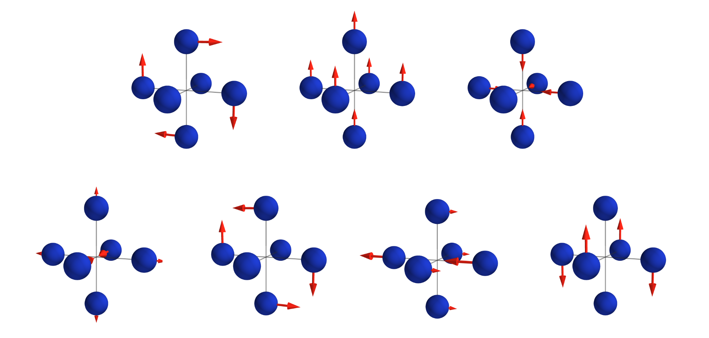

[](https://zenodo.org/badge/latestdoi/392753173)
# Overview
Polyhedron distortion analysis using group theory.
This could either be used as a standalone script or as an API.

# Background
This code allows you to convert distortions into a small-sized vector, possibly suitable for machine learning input.
An example for octahedron is given, but it is applicable to any type of polyhedron.

# Contents
## Dependencies
- numpy
- phonopy (developed with version 2.8)
- pymatgen (developed with version 2022.0.8)

## Installation
The two scripts `basis_generator.py` and `polyhedron_analysis.py` does not rely on each other.
The installation procedure is the same as other python scripts.

If you want to use it as a script, you can simply execute it anywhere.

If you want to use the API, you could either:
- export PYTHONPATH=\<full path to the polyhedron_distortion directory\>:$PYTHONPATH
- copy the script to the place of your script

# Usage
## As a script
- ### creating basis sets
```
python basis_generator.py
```
This will create octahedron basis sets written as a json file inside the `basis` directory.
The repository already includes this output.
- ### projection onto the basis set (simple)
```
python polyhedron_analysis.py POSCAR n
```
where POSCAR is [VASP](https://www.vasp.at/) POSCAR and n is the index of atom in the centre of the octahedron.
Use the API for other input types.

- ### projection onto the basis set with explicit ligand indices
```
python polyhedron_analysis_set_ligands.py POSCAR n m1 m2 m3 m4 m5 m6
```
where POSCAR is [VASP](https://www.vasp.at/) POSCAR, n is the index of atom in the centre of the octahedron, and m1 is the index atom of a ligands (same with m2, m3, m4, m5, m6).
Use the API for other input types.

## As an API
- see [Tutorial notebook](https://github.com/KazMorita/polyhedron_distortion/blob/main/Tutorial1_API.ipynb)

# Caveats
- Updates may include breaking changes. Specify versions to obtain reproducible results.

# Citation
See the following paper for the theoretical background.
[K. Morita, D. W. Davies, K. T. Butler and A. Walsh, "Breaking the aristotype: featurization of polyhedral distortions in perovskite crystals"](https://pubs.acs.org/doi/abs/10.1021/acs.chemmater.1c02959)

